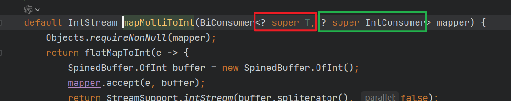
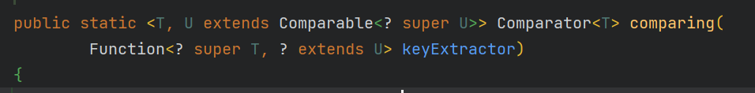
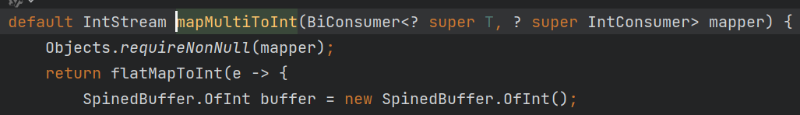

# <font color='green'> Stream API  </font>
-- ------------

环境：JDK17
-- ------------

# 1. 认识Stream
Stream本身不是数据结构，不会存储数据或改变数据源，它仅定义处理方式，可以视为一种高级迭代器，不仅支持顺序处理，
还能进行并行处理，为集合的过滤，映射，聚合等操作提供了一种高效简洁的实现方式。 <br>


# 2. 创建Stream
## 2.1 从集合创建流
任何实现了`Collection`接口的集合都可以通过调用`stream()`或者`parallelStream()`方法创建流。
```java
public class CreateStreamApiDemo {

    public static void main(String[] args) {
        List<String> lists = List.of("a", "b", "c", "d");
        Stream<String> stream = lists.stream();
        stream.forEach(System.out::println);
    }
}
```
## 2.2 从数组创建流
```java
import java.util.Arrays;
import java.util.stream.Stream;

public class CreateStreamApiDemo {

    public static void main(String[] args) {
        String[] array = {"a", "b", "c", "d"};
        Stream<String> stream = Arrays.stream(array);
        stream.forEach(System.out::println);
    }
}    
```
## 2.3 调用Stream.of()从一组值中创建流
```java
public class CreateStreamApiDemo {

    public static void main(String[] args) {

        Stream<String> stream1 = Stream.of("a", "b", "c");
        //stream1.forEach(System.out::println);
        Stream<String> stream2 = Stream.of("x", "y", "z");

        //合并流
        Stream<String> concat = Stream.concat(stream2, stream1);
        concat.forEach(System.out::println);
    }
}
```
## 2.4 使用Stream.builder()方法动态添加元素和创建流
```java
public class CreateStreamApiDemo {

    public static void main(String[] args) {

        Stream.Builder<String> builder = Stream.builder();
        builder.add("a");
        builder.add("b");
        if (Math.random() > 0.5) {
            builder.add("c"); //50%的机会会添加c
        }

        //一旦调用build()方法就不能再继续往builder中添加元素，否则会抛出异常
        Stream<String> stream = builder.build();
        stream.forEach(System.out::println);
    }
}    
```
## 2.5 从文件创建流
```java
import java.io.IOException;
import java.nio.file.Files;
import java.nio.file.Path;
import java.nio.file.Paths;
import java.util.stream.Stream;

/**
 * @author fu yuan hui
 * @since 2024-07-09 22:42:06 Tuesday
 *
 */
public class CreateStreamApiDemo {

    public static void main(String[] args) {

        Path path = Paths.get("test.txt");
        //逐行读取
        try (Stream<String> lines = Files.lines(path)) {
            lines.forEach(System.out::println);
        } catch (IOException e) {
            e.printStackTrace();
        }
    }
}    
```
## 2.6 基本类型数据的流

```java
import java.util.concurrent.ThreadLocalRandom;

public class CreateStreamApiDemo {

    public static void main(String[] args) {
        //从指定的基本类型数据中创建流
        IntStream intStream = IntStream.of(1, 2, 3);
        //intStream.forEach(System.out::println);

        //从基本类型转成包装类型
        Stream<Integer> boxed = intStream.boxed();

        //从范围指定流 [1, 5), 包含1,不包含5
        IntStream intStream2 = IntStream.range(1, 5);
        //intStream2.forEach(System.out::println);

        //从范围指定流 [1, 5]
        IntStream intStream3 = IntStream.rangeClosed(1, 5);
        //intStream3.forEach(System.out::println);


        //生成随机5个整数的流
        IntStream ints = new Random().ints(5);
        ints.forEach(System.out::println);
    }
}    
```

## 2.7 创建无限流：没有固定大小的流
> 可以使用 `generate()`, `iterate()` 创建无限流, 创建无限流时要谨慎，必须无限循环的发生，所以一般结合`limit`操作
```java
public class CreateStreamApiDemo {
    
    public static void main(String[] args) {
        //这样会生成无数个'China', 所以要集合limit操作
        //Stream<String> generate = Stream.generate(() -> "China");
        Stream<String> generate = Stream.generate(() -> "China").limit(5);
        //generate.forEach(System.out::println);

        //生成5个随机数
        Stream<Double> limit = Stream.generate(Math::random).limit(5);
        //limit.forEach(System.out::println);

        /*
          iterate() 方法主要是用来生成数学序列或实现迭代算法
         */
        // 这样会生成一个包含无限数字的等差数列
        //Stream<Integer> iterate = Stream.iterate(2, n -> n + 2);
        Stream<Integer> iterate = Stream.iterate(2, n -> n + 2).limit(5);
        iterate.forEach(System.out::println);

        //还可以直接指定终止条件，不用在使用limit来限制了
        Stream<Integer> iterate1 = Stream.iterate(2, n -> n <= 20, n -> n + 2);
        iterate1.forEach(System.out::println);
    }
}
```

## 2.8 创建并行流或者串行流调用`parallel()`方法转成并行流
```java
public class CreateStreamApiDemo {
    
    public static void main(String[] args) {
        //转成并行流
        Stream<String> parallelStream = Stream.of("beiJin", "a", "b", "c", "d", "e").parallel();
        //parallelStream.forEach(System.out::println);
        parallelStream.forEachOrdered(System.out::println);


        Stream<String> stringStream = List.of("a", "b", "c").parallelStream();
        stringStream.forEach(System.out::println);

    }
}
```

# 3. 中间操作


## 3.1 过滤和切片
1. filter() 过滤
2. distinct() 去重，底层为了一个HashSet, 注意对象去重要重写equals和hashcode方法
3. limit(n) 提取流中的前n个元素，如果指定数量大于流中元素数量，则返回所有元素
4. skip(n) 跳过前n个元素，如果指定数量大于流中元素数量，则返回空流

```java
public class MiddleOperationDemo {
    
    public static void main(String[] args) {
        List<Person> peoples = List.of(new Person("张三", 16, "中国"),
                new Person("AoLi", 35, "澳大利亚"),
                new Person("Tony", 46, "美国"),
                new Person("田七", 26, "中国"),
                new Person("波多野结衣", 30, "日本"),
                new Person("波多野结衣", 30, "日本"));

        /*
          提取年龄大于30的人
         */
        peoples.stream()
                .filter(person -> person.getAge() > 30)
                .forEach(System.out::println);

        System.out.println("--------------------------------------------------------");
         /*
          提取流中的前2个元素，如果指定数量大于流中元素数量，则返回所有元素
         */
          peoples.stream()
                  .limit(2)
                  .forEach(System.out::println);


        System.out.println("--------------------------------------------------------");
        /*
          跳过前2个元素,如果指定数量大于流中元素数量，则返回空流
         */
        peoples.stream()
                .skip(2)
                .forEach(System.out::println);

        System.out.println("--------------------------------------------------------");

        /*
          distinct() : 去重
         */
        Stream.of("Apple", "Apple", "Orange", "Apple", "Orange")
                .distinct()
                .forEach(System.out::println);


        System.out.println("--------------------------------------------------------");

        /*
        对象如果去重，必须要重写equal和hashcode方法,我用的是lombok的@Data注解，已经帮我实现了
         */
        peoples.stream()
                .distinct()
                .forEach(System.out::println);

    }
}
```

## 3.2 映射
* map() 方法:  适用于单层结构的流，进行元素一对一的转换，例如更改数据类型或者提取信息，对于嵌套的集合，数组或其他多层结构的数据处理不够灵活，这种情况下flatMap成为更合适的选择。
* flatMap()方法: 不仅能够执行map的转换功能，还能够扁平化多层数据结构，将他们转换合并成一个单层流.

### 3.2.1 测试map
```java
public class MiddleOperationDemo {

    public static void main(String[] args) {
        List<Person> peoples = List.of(new Person("张三", 16, "中国"),
                new Person("AoLi", 35, "澳大利亚"),
                new Person("Tony", 46, "美国"),
                new Person("田七", 26, "中国"),
                new Person("波多野结衣", 30, "日本"));


        //提取对象中的名字
        peoples.stream()
                .map(Person::getName)
                .forEach(System.out::println);
    }
}
```

### 3.2.2 测试 flatMap
```java
public class MiddleOperationDemo {

    public static void main(String[] args) {

        List<List<Person>> peopleGroups = List.of(
                List.of(
                        new Person("张三", 16, "中国"),
                        new Person("AoLi", 35, "澳大利亚")
                ),
                List.of(new Person("Tony", 46, "美国"),
                        new Person("田七", 26, "中国")
                ),
                List.of(new Person("波多野结衣", 30, "日本"))
        );

        peopleGroups.stream()
                //扁平化成单一的流，就是它会自动的进行合并
                .flatMap(Collection::stream)
                //再用map提取数据
                .map(Person::getName)
                .forEach(System.out::println);

    }
}
```
图示一下:


> 从第二个Stream到第三个Stream,就是flatMap的自动合并，将多层流合并成单层流

还可以这样:

```java
public class MiddleOperationDemo {

    public static void main(String[] args) {

        List<List<Person>> peopleGroups = List.of(
                List.of(
                        new Person("张三", 16, "中国"),
                        new Person("AoLi", 35, "澳大利亚")
                ),
                List.of(new Person("Tony", 46, "美国"),
                        new Person("田七", 26, "中国")
                ),
                List.of(new Person("波多野结衣", 30, "日本"))
        );


        peopleGroups.stream()
                .flatMap(people -> people.stream().map(Person::getName))
                .forEach(System.out::println);
    }
}
```

图示一下：


> 从第二个Stream到第三个Stream,就是flatMap的自动合并，将多层流合并成单层流

<br>

前面我们说了, `flatMap`也可以做`map`的功能，接下来我们看下用`flatMap`代替`map`实现提取对象的名字

```java
public class MiddleOperationDemo {

    public static void main(String[] args) {
        List<Person> peoples = List.of(new Person("张三", 16, "中国"),
                new Person("AoLi", 35, "澳大利亚"),
                new Person("Tony", 46, "美国"),
                new Person("田七", 26, "中国"),
                new Person("波多野结衣", 30, "日本"));


        //提取对象中的名字
        peoples.stream()
                //返回的是一个Stream流，所以用Stream.of方法将每一个转换后的元素单独创建一个流，最终flatMap会将这些流合并
                .flatMap(person -> Stream.of(person.getName()))
                .forEach(System.out::println);
    }
}
```
> 虽然能实现功能，但是一般不推荐这么做，既复杂又影响性能

### 3.2.3 测试 mapToInt

```java
public class MiddleOperationDemo {

    public static void main(String[] args) {
        List<Person> peoples = List.of(new Person("张三", 16, "中国"),
                new Person("AoLi", 35, "澳大利亚"),
                new Person("Tony", 46, "美国"),
                new Person("田七", 26, "中国"),
                new Person("波多野结衣", 30, "日本"));

        //提取对象中的年龄
        IntStream intStream = peoples.stream().mapToInt(Person::getAge);
        //intStream.forEach(System.out::println);

        //把所有名字长度超过3个字符的人的年龄打印出来：
        peoples.stream().mapMultiToInt((person, consumer) -> {
            if (person.getName().length() >= 5) {
                consumer.accept(person.getAge());
            }
        }).forEach(System.out::println);
    }
}
```

> 可以看到 `mapMultiToInt`方法有2个参数，一个是流中的元素，另一个是IntConsumer


## 3.3 排序

字符串排序：
```java
public class MiddleOperationDemo {
    
    public static void main(String[] args) {
        /*
            Moon
            apple
            blueBerry
            cheery
            pear
            默认的排序是基于 String 类的自然顺序，而这种自然顺序是依赖于字典序（lexicographical order），但它是区分大小写的。
            在 Java 中，String 的自然顺序是基于 Unicode 值进行排序的，因此大写字母会排在小写字母之前。具体来说，所有大写字母的 Unicode
            值都小于小写字母的 Unicode 值，这导致在排序时，大写字母会优先出现在排序结果中。
         */
        Stream.of("blueBerry", "cheery", "apple", "pear", "Moon")
                .sorted()
                .forEach(System.out::println);


        System.out.println("----------------------------------------------------------------");
        /*
           按字符长度自然排序(从小到大)
         */
        Stream.of("blueBerry", "cheery", "apple", "pear", "Moon")
                .sorted(Comparator.comparingInt(String::length))
                .forEach(System.out::println);


        System.out.println("----------------------------------------------------------------");
        /*
           按字符长度降序排序,调用 reversed()方法
         */
        Stream.of("blueBerry", "cheery", "apple", "pear", "Moon")
                .sorted(Comparator.comparingInt(String::length).reversed())
                .forEach(System.out::println);
    }
}
```

对象排序：

```java
public class MiddleOperationDemo {

    public static void main(String[] args) {
        List<Person> peoples = List.of(new Person("张三", 16, "中国"),
                new Person("aoLiNa", 35, "澳大利亚"),
                new Person("Tony", 46, "美国"),
                new Person("田七七", 26, "中国"),
                new Person("波多野结衣", 30, "日本"));


        /*
           输出结果：
            Person(name=张三, age=16, country=中国)
            Person(name=田七七, age=26, country=中国)
            Person(name=Tony, age=46, country=美国)
            Person(name=波多野结衣, age=30, country=日本)
            Person(name=AoLiNa, age=35, country=澳大利亚)
         */
        peoples.stream()
                //根据姓名的长度自然排序
                //.sorted(Comparator.comparing(person -> person, (o1, o2) -> o1.getName().length() - o2.getName().length()))
                //.sorted(Comparator.comparing(p -> p, Comparator.comparing(o -> o.getName().length())))
                .sorted(Comparator.comparingInt(p -> p.getName().length()))
                .forEach(System.out::println);

        System.out.println("-------------------------------------------------------");

        /*
          输出结果：英文的大写，英文的小写，中文
            Person(name=Tony, age=46, country=美国)
            Person(name=aoLiNa, age=35, country=澳大利亚)
            Person(name=张三, age=16, country=中国)
            Person(name=波多野结衣, age=30, country=日本)
            Person(name=田七七, age=26, country=中国)
         */
        peoples.stream()
                // 这种写法被优化成下面的写法，按照名字自然排序
                //.sorted(Comparator.comparing(Person::getName, (o1, o2) -> o1.compareTo(o2)))
                .sorted(Comparator.comparing(Person::getName, Comparator.naturalOrder()))
                .forEach(System.out::println);


        System.out.println("--------------------------------------------------------");
        /*
          按照年龄自然排序，等价于：sorted(Comparator.comparingInt(Person::getAge))
          注意看下comparing方法
         */
        peoples.stream()
                .sorted(Comparator.comparing(Person::getAge))
                .forEach(System.out::println);
    }
}
```

问题? <br>
对比 `Comparator.comparing(Person::getAge)` 方法 `stream().mapMultiToInt`方法，为什么参数传递会不一样呢？
 <br>


为什么写法上不同呢？
```java
   peoples.stream()
          .sorted(Comparator.comparing(Person::getAge))
          .forEach(System.out::println);


    peoples.stream().mapMultiToInt((person, consumer) -> {
       if (person.getName().length() >= 5) {
          consumer.accept(person.getAge());
       }
    }).forEach(System.out::println);
```
> 为什么一个传1个参数，一个传2个参数呢？

<b>原因是因为 `mapMultiToInt`的参数是 `BiConsumer<T, U>`, 而T,U都是参数，所以参数是2个; 而 `comparing`方法的参数是 `Function<T, R>`, 其中T是参数，R是返回值，所以它的参数是一个。</b>

