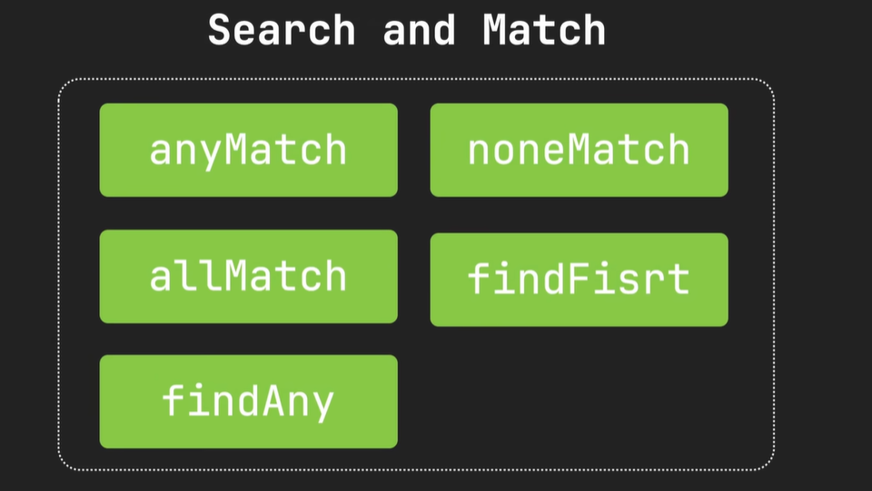
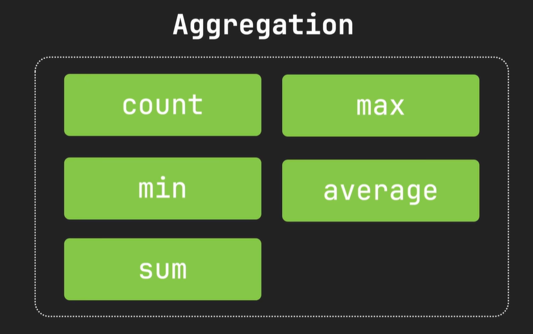
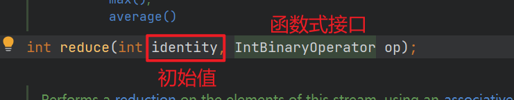
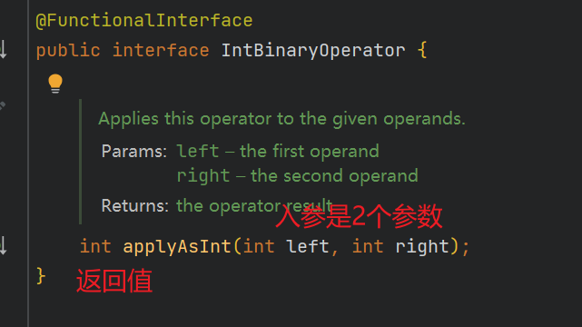
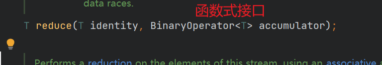
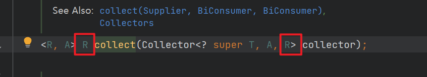

# <font color='green'> Stream API  </font>
-- ------------

环境：JDK17
-- ------------

# 1. 认识Stream
Stream本身不是数据结构，不会存储数据或改变数据源，它仅定义处理方式，可以视为一种高级迭代器，不仅支持顺序处理，
还能进行并行处理，为集合的过滤，映射，聚合等操作提供了一种高效简洁的实现方式。 <br>


# 2. 创建Stream
## 2.1 从集合创建流
任何实现了`Collection`接口的集合都可以通过调用`stream()`或者`parallelStream()`方法创建流。
```java
public class CreateStreamApiDemo {

    public static void main(String[] args) {
        List<String> lists = List.of("a", "b", "c", "d");
        Stream<String> stream = lists.stream();
        stream.forEach(System.out::println);
    }
}
```
## 2.2 从数组创建流
```java
import java.util.Arrays;
import java.util.stream.Stream;

public class CreateStreamApiDemo {

    public static void main(String[] args) {
        String[] array = {"a", "b", "c", "d"};
        Stream<String> stream = Arrays.stream(array);
        stream.forEach(System.out::println);
    }
}    
```
## 2.3 调用Stream.of()从一组值中创建流
```java
public class CreateStreamApiDemo {

    public static void main(String[] args) {

        Stream<String> stream1 = Stream.of("a", "b", "c");
        //stream1.forEach(System.out::println);
        Stream<String> stream2 = Stream.of("x", "y", "z");

        //合并流
        Stream<String> concat = Stream.concat(stream2, stream1);
        concat.forEach(System.out::println);
    }
}
```
## 2.4 使用Stream.builder()方法动态添加元素和创建流
```java
public class CreateStreamApiDemo {

    public static void main(String[] args) {

        Stream.Builder<String> builder = Stream.builder();
        builder.add("a");
        builder.add("b");
        if (Math.random() > 0.5) {
            builder.add("c"); //50%的机会会添加c
        }

        //一旦调用build()方法就不能再继续往builder中添加元素，否则会抛出异常
        Stream<String> stream = builder.build();
        stream.forEach(System.out::println);
    }
}    
```
## 2.5 从文件创建流
```java
import java.io.IOException;
import java.nio.file.Files;
import java.nio.file.Path;
import java.nio.file.Paths;
import java.util.stream.Stream;

/**
 * @author fu yuan hui
 * @since 2024-07-09 22:42:06 Tuesday
 *
 */
public class CreateStreamApiDemo {

    public static void main(String[] args) {

        Path path = Paths.get("test.txt");
        //逐行读取
        try (Stream<String> lines = Files.lines(path)) {
            lines.forEach(System.out::println);
        } catch (IOException e) {
            e.printStackTrace();
        }
    }
}    
```
## 2.6 基本类型数据的流

```java
import java.util.concurrent.ThreadLocalRandom;

public class CreateStreamApiDemo {

    public static void main(String[] args) {
        //从指定的基本类型数据中创建流
        IntStream intStream = IntStream.of(1, 2, 3);
        //intStream.forEach(System.out::println);

        //从基本类型转成包装类型
        Stream<Integer> boxed = intStream.boxed();

        //从范围指定流 [1, 5), 包含1,不包含5
        IntStream intStream2 = IntStream.range(1, 5);
        //intStream2.forEach(System.out::println);

        //从范围指定流 [1, 5]
        IntStream intStream3 = IntStream.rangeClosed(1, 5);
        //intStream3.forEach(System.out::println);


        //生成随机5个整数的流
        IntStream ints = new Random().ints(5);
        ints.forEach(System.out::println);
    }
}    
```

## 2.7 创建无限流：没有固定大小的流
> 可以使用 `generate()`, `iterate()` 创建无限流, 创建无限流时要谨慎，必须无限循环的发生，所以一般结合`limit`操作
```java
public class CreateStreamApiDemo {
    
    public static void main(String[] args) {
        //这样会生成无数个'China', 所以要集合limit操作
        //Stream<String> generate = Stream.generate(() -> "China");
        Stream<String> generate = Stream.generate(() -> "China").limit(5);
        //generate.forEach(System.out::println);

        //生成5个随机数
        Stream<Double> limit = Stream.generate(Math::random).limit(5);
        //limit.forEach(System.out::println);

        /*
          iterate() 方法主要是用来生成数学序列或实现迭代算法
         */
        // 这样会生成一个包含无限数字的等差数列
        //Stream<Integer> iterate = Stream.iterate(2, n -> n + 2);
        Stream<Integer> iterate = Stream.iterate(2, n -> n + 2).limit(5);
        iterate.forEach(System.out::println);

        //还可以直接指定终止条件，不用在使用limit来限制了
        Stream<Integer> iterate1 = Stream.iterate(2, n -> n <= 20, n -> n + 2);
        iterate1.forEach(System.out::println);
    }
}
```

## 2.8 创建并行流或者串行流调用`parallel()`方法转成并行流
```java
public class CreateStreamApiDemo {
    
    public static void main(String[] args) {
        //转成并行流
        Stream<String> parallelStream = Stream.of("beiJin", "a", "b", "c", "d", "e").parallel();
        //parallelStream.forEach(System.out::println);
        parallelStream.forEachOrdered(System.out::println);


        Stream<String> stringStream = List.of("a", "b", "c").parallelStream();
        stringStream.forEach(System.out::println);

    }
}
```

# 3. 中间操作


## 3.1 过滤和切片
1. filter() 过滤
2. distinct() 去重，底层为了一个HashSet, 注意对象去重要重写equals和hashcode方法
3. limit(n) 提取流中的前n个元素，如果指定数量大于流中元素数量，则返回所有元素
4. skip(n) 跳过前n个元素，如果指定数量大于流中元素数量，则返回空流

```java
public class MiddleOperationDemo {
    
    public static void main(String[] args) {
        List<Person> peoples = List.of(new Person("张三", 16, "中国"),
                new Person("AoLi", 35, "澳大利亚"),
                new Person("Tony", 46, "美国"),
                new Person("田七", 26, "中国"),
                new Person("波多野结衣", 30, "日本"),
                new Person("波多野结衣", 30, "日本"));

        /*
          提取年龄大于30的人
         */
        peoples.stream()
                .filter(person -> person.getAge() > 30)
                .forEach(System.out::println);

        System.out.println("--------------------------------------------------------");
         /*
          提取流中的前2个元素，如果指定数量大于流中元素数量，则返回所有元素
         */
          peoples.stream()
                  .limit(2)
                  .forEach(System.out::println);


        System.out.println("--------------------------------------------------------");
        /*
          跳过前2个元素,如果指定数量大于流中元素数量，则返回空流
         */
        peoples.stream()
                .skip(2)
                .forEach(System.out::println);

        System.out.println("--------------------------------------------------------");

        /*
          distinct() : 去重
         */
        Stream.of("Apple", "Apple", "Orange", "Apple", "Orange")
                .distinct()
                .forEach(System.out::println);


        System.out.println("--------------------------------------------------------");

        /*
        对象如果去重，必须要重写equal和hashcode方法,我用的是lombok的@Data注解，已经帮我实现了
         */
        peoples.stream()
                .distinct()
                .forEach(System.out::println);

    }
}
```

## 3.2 映射
* map() 方法:  适用于单层结构的流，进行元素一对一的转换，例如更改数据类型或者提取信息，对于嵌套的集合，数组或其他多层结构的数据处理不够灵活，这种情况下flatMap成为更合适的选择。
* flatMap()方法: 不仅能够执行map的转换功能，还能够扁平化多层数据结构，将他们转换合并成一个单层流.

### 3.2.1 测试map
```java
public class MiddleOperationDemo {

    public static void main(String[] args) {
        List<Person> peoples = List.of(new Person("张三", 16, "中国"),
                new Person("AoLi", 35, "澳大利亚"),
                new Person("Tony", 46, "美国"),
                new Person("田七", 26, "中国"),
                new Person("波多野结衣", 30, "日本"));


        //提取对象中的名字
        peoples.stream()
                .map(Person::getName)
                .forEach(System.out::println);
    }
}
```

### 3.2.2 测试 flatMap
```java
public class MiddleOperationDemo {

    public static void main(String[] args) {

        List<List<Person>> peopleGroups = List.of(
                List.of(
                        new Person("张三", 16, "中国"),
                        new Person("AoLi", 35, "澳大利亚")
                ),
                List.of(new Person("Tony", 46, "美国"),
                        new Person("田七", 26, "中国")
                ),
                List.of(new Person("波多野结衣", 30, "日本"))
        );

        peopleGroups.stream()
                //扁平化成单一的流，就是它会自动的进行合并
                .flatMap(Collection::stream)
                //再用map提取数据
                .map(Person::getName)
                .forEach(System.out::println);

    }
}
```
图示一下:


> 从第二个Stream到第三个Stream,就是flatMap的自动合并，将多层流合并成单层流

还可以这样:

```java
public class MiddleOperationDemo {

    public static void main(String[] args) {

        List<List<Person>> peopleGroups = List.of(
                List.of(
                        new Person("张三", 16, "中国"),
                        new Person("AoLi", 35, "澳大利亚")
                ),
                List.of(new Person("Tony", 46, "美国"),
                        new Person("田七", 26, "中国")
                ),
                List.of(new Person("波多野结衣", 30, "日本"))
        );


        peopleGroups.stream()
                .flatMap(people -> people.stream().map(Person::getName))
                .forEach(System.out::println);
    }
}
```

图示一下：


> 从第二个Stream到第三个Stream,就是flatMap的自动合并，将多层流合并成单层流

<br>

前面我们说了, `flatMap`也可以做`map`的功能，接下来我们看下用`flatMap`代替`map`实现提取对象的名字

```java
public class MiddleOperationDemo {

    public static void main(String[] args) {
        List<Person> peoples = List.of(new Person("张三", 16, "中国"),
                new Person("AoLi", 35, "澳大利亚"),
                new Person("Tony", 46, "美国"),
                new Person("田七", 26, "中国"),
                new Person("波多野结衣", 30, "日本"));


        //提取对象中的名字
        peoples.stream()
                //返回的是一个Stream流，所以用Stream.of方法将每一个转换后的元素单独创建一个流，最终flatMap会将这些流合并
                .flatMap(person -> Stream.of(person.getName()))
                .forEach(System.out::println);
    }
}
```
> 虽然能实现功能，但是一般不推荐这么做，既复杂又影响性能

### 3.2.3 测试 mapToInt

```java
public class MiddleOperationDemo {

    public static void main(String[] args) {
        List<Person> peoples = List.of(new Person("张三", 16, "中国"),
                new Person("AoLi", 35, "澳大利亚"),
                new Person("Tony", 46, "美国"),
                new Person("田七", 26, "中国"),
                new Person("波多野结衣", 30, "日本"));

        //提取对象中的年龄
        IntStream intStream = peoples.stream().mapToInt(Person::getAge);
        //intStream.forEach(System.out::println);

        //把所有名字长度超过3个字符的人的年龄打印出来：
        peoples.stream().mapMultiToInt((person, consumer) -> {
            if (person.getName().length() >= 5) {
                consumer.accept(person.getAge());
            }
        }).forEach(System.out::println);
    }
}
```

> 可以看到 `mapMultiToInt`方法有2个参数，一个是流中的元素，另一个是IntConsumer


## 3.3 排序

字符串排序：
```java
public class MiddleOperationDemo {
    
    public static void main(String[] args) {
        /*
            Moon
            apple
            blueBerry
            cheery
            pear
            默认的排序是基于 String 类的自然顺序，而这种自然顺序是依赖于字典序（lexicographical order），但它是区分大小写的。
            在 Java 中，String 的自然顺序是基于 Unicode 值进行排序的，因此大写字母会排在小写字母之前。具体来说，所有大写字母的 Unicode
            值都小于小写字母的 Unicode 值，这导致在排序时，大写字母会优先出现在排序结果中。
         */
        Stream.of("blueBerry", "cheery", "apple", "pear", "Moon")
                .sorted()
                .forEach(System.out::println);


        System.out.println("----------------------------------------------------------------");
        /*
           按字符长度自然排序(从小到大)
         */
        Stream.of("blueBerry", "cheery", "apple", "pear", "Moon")
                .sorted(Comparator.comparingInt(String::length))
                .forEach(System.out::println);


        System.out.println("----------------------------------------------------------------");
        /*
           按字符长度降序排序,调用 reversed()方法
         */
        Stream.of("blueBerry", "cheery", "apple", "pear", "Moon")
                .sorted(Comparator.comparingInt(String::length).reversed())
                .forEach(System.out::println);
    }
}
```

对象排序：

```java
public class MiddleOperationDemo {

    public static void main(String[] args) {
        List<Person> peoples = List.of(new Person("张三", 16, "中国"),
                new Person("aoLiNa", 35, "澳大利亚"),
                new Person("Tony", 46, "美国"),
                new Person("田七七", 26, "中国"),
                new Person("波多野结衣", 30, "日本"));


        /*
           输出结果：
            Person(name=张三, age=16, country=中国)
            Person(name=田七七, age=26, country=中国)
            Person(name=Tony, age=46, country=美国)
            Person(name=波多野结衣, age=30, country=日本)
            Person(name=AoLiNa, age=35, country=澳大利亚)
         */
        peoples.stream()
                //根据姓名的长度自然排序
                //.sorted(Comparator.comparing(person -> person, (o1, o2) -> o1.getName().length() - o2.getName().length()))
                //.sorted(Comparator.comparing(p -> p, Comparator.comparing(o -> o.getName().length())))
                .sorted(Comparator.comparingInt(p -> p.getName().length()))
                .forEach(System.out::println);

        System.out.println("-------------------------------------------------------");

        /*
          输出结果：英文的大写，英文的小写，中文
            Person(name=Tony, age=46, country=美国)
            Person(name=aoLiNa, age=35, country=澳大利亚)
            Person(name=张三, age=16, country=中国)
            Person(name=波多野结衣, age=30, country=日本)
            Person(name=田七七, age=26, country=中国)
         */
        peoples.stream()
                // 这种写法被优化成下面的写法，按照名字自然排序
                //.sorted(Comparator.comparing(Person::getName, (o1, o2) -> o1.compareTo(o2)))
                .sorted(Comparator.comparing(Person::getName, Comparator.naturalOrder()))
                .forEach(System.out::println);


        System.out.println("--------------------------------------------------------");
        /*
          按照年龄自然排序，等价于：sorted(Comparator.comparingInt(Person::getAge))
          注意看下comparing方法
         */
        peoples.stream()
                .sorted(Comparator.comparing(Person::getAge))
                .forEach(System.out::println);
    }
}
```

问题? <br>
对比 `Comparator.comparing(Person::getAge)` 方法 `stream().mapMultiToInt`方法，为什么参数传递会不一样呢？
 <br>


为什么写法上不同呢？
```java
   peoples.stream()
          .sorted(Comparator.comparing(Person::getAge))
          .forEach(System.out::println);


    peoples.stream().mapMultiToInt((person, consumer) -> {
       if (person.getName().length() >= 5) {
          consumer.accept(person.getAge());
       }
    }).forEach(System.out::println);
```
> 为什么一个传1个参数，一个传2个参数呢？

<b>原因是因为 `mapMultiToInt`的参数是 `BiConsumer<T, U>`, 而T,U都是参数，所以参数是2个; 而 `comparing`方法的参数是 `Function<T, R>`, 其中T是参数，R是返回值，所以它的参数是一个。</b>

# 4. 终端操作


## 4.1 查找与匹配

这类属于`短路操作`，这个因为这些操作再找到符合条件的元素后会立即结束处理，返回结果，而不需要处理整个流
有效短路了流的遍历，提高了处理效率，特别适用再快速筛选和数据验证的场景中。<br>

* anyMatch(): 如果流中有任意一个元素符合条件，则返回true，否则返回false。
* noneMatch(): 如果流中所有元素都不符合条件，则返回true，否则返回false。
* allMatch(): 如果流中所有元素都符合条件，则返回true，否则返回false。
* findFirst(): 返回流中第一个元素
* findAny(): 符合流中任意一个元素

```java
public class TerminalOperationDemo {
    
    public static void main(String[] args) {
        List<Person> peoples = List.of(new Person("张三", 16, "中国"),
                new Person("AoLi", 35, "澳大利亚"),
                new Person("Tony", 46, "美国"),
                new Person("田七", 26, "中国"),
                new Person("波多野结衣", 30, "日本"));

        //如果任意一个元素满足条件，则返回true
        boolean anyMatch = peoples.stream()
                .anyMatch(person -> person.getAge() > 100);
        System.out.println("anyMatch = " + anyMatch);

        System.out.println("------------------------------------");

        //如果流中所有元素都不符合条件的，就返回true
        boolean noneMatch = peoples.stream()
                .noneMatch(person -> person.getAge() > 30);
        System.out.println("noneMatch = " + noneMatch);

        System.out.println("------------------------------------");


        //如果流中所有元素都符合条件的，就返回true
        boolean allMatch = peoples.stream()
                .allMatch(person -> person.getAge() > 10);
        System.out.println("allMatch = " + allMatch);

        System.out.println("------------------------------------");

        //查找第一个元素
        Optional<Person> first = peoples.stream().findFirst();
        first.ifPresent(System.out::println);

        System.out.println("------------------------------------");

        //查找任意一个元素
        Optional<Person> findAny = peoples.stream().findAny();
        findAny.ifPresent(System.out::println);
    }
}
```

## 4.2 聚合操作

```java
public class TerminalOperationDemo {
    
    public static void main(String[] args) {
        List<Person> persons = List.of(
                new Person("张三", 16, "中国"),
                new Person("AoLi", 35, "澳大利亚"),
                new Person("Tony", 46, "美国"),
                new Person("田七", 26, "中国"),
                new Person("波多野结衣", 30, "日本")
        );

        //计算流中元素的个数
        long count = persons.stream().count();
        System.out.println("count = " + count);

        //统计流中元素年龄最大的一个
        persons.stream()
                .min(Comparator.comparingInt(Person::getAge))
                //.max(Comparator.comparingInt(Person::getAge))
                .ifPresent(System.out::println);


        //求和，平均值等这些要作用在基本数据类型上
        IntStream intStream = persons.stream().mapToInt(Person::getAge);
        int sum = intStream.sum();
        System.out.println("sum = " + sum);

        //请平均值
        IntStream intStream1 = persons.stream().mapToInt(Person::getAge);
        intStream1.average().ifPresent(System.out::println);
    }
}
```

## 4.3 reduce 规约
> 本质上`聚合操作`是`reduce规约操作`的一种特殊形式，聚合操作适用于快捷简单的统计任务，比如求和，平均值，最大最小值等等，而规约操作reduce则更为通用，
它可以通过自定义的累加器函数对流中的所有元素进行迭代处理，以累计中最终的结果。可以实现任何类型的结果汇总，不仅限于数学上的聚合，而是任何形式的数据
合并，比如拼接字符串，合并集合等等。

```java
public class TerminalOperationDemo {
    
    public static void main(String[] args) {
        List<Person> persons = List.of(
                new Person("张三", 16, "男", "中国"),
                new Person("AoLi", 35, "女", "澳大利亚"),
                new Person("Tony", 46, "男", "美国"),
                new Person("田七", 26, "男", "中国"),
                new Person("波多野结衣", 30, "女", "日本")
        );


        //用reduce来实现年龄的求和
        int reduce = persons.stream()
                .mapToInt(Person::getAge)
                .reduce(0, (a, b) -> a + b);
        System.out.println("reduce 指定初始值 = " + reduce);

        //不指定初始值，它返回的是OptionalInt
        OptionalInt optionalInt = persons.stream()
                .mapToInt(Person::getAge)
                .reduce((a, b) -> a + b);
        optionalInt.ifPresent(System.out::println);


        //用reduce来实现字符串的拼接，这个聚合操作就无法实现了, 这个在收集的时候用join会更方便
        String reduceName = persons.stream()
                .map(Person::getName)
                //如果不指定初始值，它返回的是Optional
                .reduce("", (a, b) -> a + b + ",");
        System.out.println("reduceName = " + reduceName);
    }
}
```

我们看下用`reduce`求和方法的参数:


正好对应着:
```java
// a + b 是返回值
.reduce(0, (a, b) -> a + b);
```
<br>
<br>

再来看下用`reduce`拼接字符串的方法:

```java
@FunctionalInterface
public interface BinaryOperator<T> extends BiFunction<T,T,T> {
   //........
}

@FunctionalInterface
public interface BiFunction<T, U, R> {
    
    //2个参数，1个返回值
    R apply(T t, U u);
}
```

## 4.4 collect 收集
> 调用collect可以将流中的元素收集起来放到新的List, Set, Map中等，还提供了分组，分区，字符串拼接以及各种统计功能。

```java
public class TerminalOperationDemo {
    
    public static void main(String[] args) {
        List<Person> persons = List.of(
                new Person("张三", 16, "男", "中国"),
                new Person("AoLi", 35, "女", "美国"),
                new Person("Tony", 46, "男","美国"),
                new Person("田七", 26, "男","中国"),
                new Person("波多野结衣", 30, "女","日本"),
                new Person("波多野结衣", 30, "女","日本2")
        );

        //转成Map, 姓名作为key, person作为value
        try {
            //如果key存在重复的，将会报错
            Map<String, Person> personMap = persons.stream().collect(Collectors.toMap(Person::getName, person -> person));
            personMap.forEach((k, v) -> System.out.println("key = " + k + " value = " + v));
        } catch (Exception e) {
            e.printStackTrace();
        }

        //如果key重复了会报错，所以用第三个参数指定key规则
        Map<String, String> personCountryMap = persons.stream()
                .collect(Collectors.toMap(
                        Person::getName,
                        Person::getCountry,
                        (k1, k2) -> k2));
        personCountryMap.forEach((k, v) -> System.out.println("key = " + k + " value = " + v));

        System.out.println("-------------------------------------------------");

        //分组
        Map<String, List<Person>> collect = persons.stream().collect(Collectors.groupingBy(Person::getCountry));
        collect.forEach((k, v) -> System.out.println("key = " + k + " value = " + v));

        Map<String, Long> collect2 = persons.stream().collect(Collectors.groupingBy(Person::getCountry, Collectors.counting()));
        collect2.forEach((k, v) -> System.out.println("key = " + k + " value = " + v));

        System.out.println("-------------------------------------------------");

        //分区,年龄大于30的分一个区，小于等于30的分一个区
        Map<Boolean, List<Person>> partitioningBy = persons.stream().collect(Collectors.partitioningBy(person -> person.getAge() > 30));
        partitioningBy.forEach((k, v) -> System.out.println("key = " + k + " value = " + v));

        System.out.println("-------------------------------------------------");

        //字符串的拼接,要比reduce好用
        String collect1 = persons.stream()
                .map(Person::getName)
                //默认是逗号
                .collect(Collectors.joining("#"));
        System.out.println("collect1 = " + collect1);

        System.out.println("-------------------------------------------------");

        //按照年龄进行统计
        IntSummaryStatistics ageSummary = persons.stream().collect(Collectors.summarizingInt(Person::getAge));
        System.out.println("年龄的平均值 = " + ageSummary.getAverage());
        System.out.println("年龄的最大值 = " + ageSummary.getMax());
        System.out.println("年龄的最小值 = " + ageSummary.getMin());

    }
}
```
简单看下
`
persons.stream().collect(Collectors.groupingBy(Person::getCountry));
`

collect()方法的定义：

<br>
collect是一个泛型方法，Collector第三个泛型参数就是collect的返回值。

## 4.5 自定义collector来模拟收集功能
为了更好的理解Collector的收集过程和以上这些方法的实现机制，从而掌握并实现更为复杂的收集策略。通过看Collector源码结构可以知道：
```java
public interface Collector<T, A, R> {
    /**
     * 供应器：
     * 创建一个保存收集结果的容器
     */
    Supplier<A> supplier();

    /**
     * 累加器：
     * 将结果添加到上面的容器中
     */
    BiConsumer<A, T> accumulator();

    /**
     * 合并器：
     * 用于在并行流中，将不同线程中的供应器提供的数据收集容器的结果给合并起来，如果是串行流就无需使用它了，定义了也不会执行。
     */
    BinaryOperator<A> combiner();

    /**
     * 完成器：
     * 可以对结果进一步处理，比如从类型A映射成类型B
     * result
     */
    Function<A, R> finisher();

    /**
     * 收集策略
     */
    Set<Characteristics> characteristics();

    /**
     *
     * @param supplier: 创建一个保存收集结果的容器
     * @param accumulator: 累加器，两个参数，第一个参数(R)是容器，第二个参数是元素(T)
     * @param combiner 组合器：接收2个参数，返回值是R  
     * @param characteristics 收集策略
     *                   
     */
    public static<T, R> Collector<T, R, R> of(Supplier<R> supplier,
                                              BiConsumer<R, T> accumulator,
                                              BinaryOperator<R> combiner,
                                              Characteristics... characteristics) {
        Objects.requireNonNull(supplier);
        Objects.requireNonNull(accumulator);
        Objects.requireNonNull(combiner);
        Objects.requireNonNull(characteristics);
        Set<Characteristics> cs = (characteristics.length == 0)
                                  ? Collectors.CH_ID
                                  : Collections.unmodifiableSet(EnumSet.of(Collector.Characteristics.IDENTITY_FINISH,
                                                                           characteristics));
        return new Collectors.CollectorImpl<>(supplier, accumulator, combiner, cs);
    }

    /**
     *
     * @param supplier: 创建一个保存收集结果的容器
     * @param accumulator: 累加器，两个参数，第一个参数(R)是容器，第二个参数是元素(T)
     * @param combiner 组合器：接收2个参数，返回值是R  
     * @param finisher: 自定义的完成器：可以对累加器的结果进一步处理，如果使用 {@link Characteristics#IDENTITY_FINISH} 表示直接将累加器的结果作为最终结果返回。
     * @param characteristics 收集策略
     */
    public static<T, A, R> Collector<T, A, R> of(Supplier<A> supplier,
                                                 BiConsumer<A, T> accumulator,
                                                 BinaryOperator<A> combiner,
                                                 Function<A, R> finisher,
                                                 Characteristics... characteristics) {
        Objects.requireNonNull(supplier);
        Objects.requireNonNull(accumulator);
        Objects.requireNonNull(combiner);
        Objects.requireNonNull(finisher);
        Objects.requireNonNull(characteristics);
        Set<Characteristics> cs = Collectors.CH_NOID;
        if (characteristics.length > 0) {
            cs = EnumSet.noneOf(Characteristics.class);
            Collections.addAll(cs, characteristics);
            cs = Collections.unmodifiableSet(cs);
        }
        return new Collectors.CollectorImpl<>(supplier, accumulator, combiner, finisher, cs);
    }

    /**
     * Characteristics indicating properties of a {@code Collector}, which can
     * be used to optimize reduction implementations.
     */
    enum Characteristics {
        /**
         * 请看6.1
         */
        CONCURRENT,

        /**
         * 请看6.1
         */
        UNORDERED,

        /**
         * 表明累加器的结果可以直接作为最终的结果输出。无需通过额外的完成器Finisher进一步处理。
         */
        IDENTITY_FINISH
    }
}
```

1. 我们自定义收集器来实现将数据收集到新的集合中。
```java
public class TerminalOperationDemo {
    
    public static void main(String[] args) {
        List<Person> persons = List.of(
                new Person("张三", 16, "男", "中国"),
                new Person("AoLi", 35, "女", "美国"),
                new Person("Tony", 46, "男","美国"),
                new Person("田七", 26, "男","中国"),
                new Person("波多野结衣", 30, "女","日本"),
                new Person("波多野结衣", 30, "女","日本2")
        );


        List<Person> collect = persons.stream()
                //.parallel()
                .collect(Collector.of(
                        () -> {
                            String name = Thread.currentThread().getName();
                            System.out.println("供应器执行[ "  + name  +"]>>>>>>>>>>>>>>>\n");
                            return new ArrayList<>();
                        },
                        (list, person) -> {
                            String name = Thread.currentThread().getName();
                            System.out.println("累加器执行[ " +  name +"] >>>>>>>>>>>>>>> " + list);
                            list.add(person);
                        },
                        (left, right) -> {
                            String name = Thread.currentThread().getName();
                            System.out.println("\n组合器执行[" + name  +"] >>>>>>>>>>>>>>>> " + left);
                            left.addAll(right);
                            return left;
                        },
                        Collector.Characteristics.IDENTITY_FINISH
                ));

        System.out.println(">>>>>>>> collect = " + collect);

    }
} 
```
输出结果：
```text
供应器执行[ main]>>>>>>>>>>>>>>>

累加器执行[ main] >>>>>>>>>>>>>>> []
累加器执行[ main] >>>>>>>>>>>>>>> [Person(name=张三, age=16, sex=男, country=中国)]
累加器执行[ main] >>>>>>>>>>>>>>> [Person(name=张三, age=16, sex=男, country=中国), Person(name=AoLi, age=35, sex=女, country=美国)]
累加器执行[ main] >>>>>>>>>>>>>>> [Person(name=张三, age=16, sex=男, country=中国), Person(name=AoLi, age=35, sex=女, country=美国), Person(name=Tony, age=46, sex=男, country=美国)]
累加器执行[ main] >>>>>>>>>>>>>>> [Person(name=张三, age=16, sex=男, country=中国), Person(name=AoLi, age=35, sex=女, country=美国), Person(name=Tony, age=46, sex=男, country=美国), Person(name=田七, age=26, sex=男, country=中国)]
累加器执行[ main] >>>>>>>>>>>>>>> [Person(name=张三, age=16, sex=男, country=中国), Person(name=AoLi, age=35, sex=女, country=美国), Person(name=Tony, age=46, sex=男, country=美国), Person(name=田七, age=26, sex=男, country=中国), Person(name=波多野结衣, age=30, sex=女, country=日本)]
>>>>>>>> collect = [Person(name=张三, age=16, sex=男, country=中国), Person(name=AoLi, age=35, sex=女, country=美国), Person(name=Tony, age=46, sex=男, country=美国), Person(name=田七, age=26, sex=男, country=中国), Person(name=波多野结衣, age=30, sex=女, country=日本), Person(name=波多野结衣, age=30, sex=女, country=日本2)]
```
> 可以看到，当是串行流时，组合器是不会执行的，当是并行流时，组合器才会执行。


2. 自定义收集器实现人员按照国家分组

```java
public class CustomCollectorDemo {

    public static void main(String[] args) {
        List<Person> persons = List.of(
                new Person("张三", 16, "男", "中国"),
                new Person("AoLi", 35, "女", "美国"),
                new Person("Tony", 46, "男", "美国"),
                new Person("田七", 26, "男", "中国"),
                new Person("波多野结衣", 30, "女", "日本"),
                new Person("波多野结衣", 30, "女", "日本2")
        );
        HashMap<String, List<Person>> collect = persons
                .stream()
                //.parallel()
                .collect(Collector.of(
                        HashMap::new,
                        (map, person) -> {
                            System.out.println("累加器执行 = " + map);
                            map.computeIfAbsent(person.getCountry(), k -> new ArrayList<>()).add(person);
                        },
                        //目的是在并行流中合并多各自累加器处理后的独立。我这里将right累加器的数据添加到left中，然后返回leftMap数据个线程
                        //如果是串行流该方法将不会执行
                        (left, right) -> {
                            String name = Thread.currentThread().getName();
                            System.out.println("合并器[" + name +"]执行>>>>>>>>>>>> left " + left + System.lineSeparator() + " right: " + right);
                            //注意：我这里的合并是指： 把线程A的Map的key=中国的List元素 和 把线程B的Map的key=中国的List元素进行合并，也就是将key相同的list合并到一个List中
                            //merge方法的第三个参数是指对value进一步进行操作
                            right.forEach((k, v) -> left.merge(k, v, (list1, list2) -> {
                                list1.addAll(list2);
                                return list1;
                            }));

                            return left;
                        },
                        Collector.Characteristics.IDENTITY_FINISH
                        //不将累加器的结果作为最终结果，而是自定义，比如我这里，直接返回分组个数
                        //map -> map.size()
                ));

        System.out.println("collect = " + collect);
    }
}
```

输出结果：
```text
累加器执行 = {}  //先初始化一个空的容器
累加器执行 = {中国=[Person(name=张三, age=16, sex=男, country=中国)]}  //开始添加元素
累加器执行 = {美国=[Person(name=AoLi, age=35, sex=女, country=美国)], 中国=[Person(name=张三, age=16, sex=男, country=中国)]}
累加器执行 = {美国=[Person(name=AoLi, age=35, sex=女, country=美国), Person(name=Tony, age=46, sex=男, country=美国)], 中国=[Person(name=张三, age=16, sex=男, country=中国)]}
累加器执行 = {美国=[Person(name=AoLi, age=35, sex=女, country=美国), Person(name=Tony, age=46, sex=男, country=美国)], 中国=[Person(name=张三, age=16, sex=男, country=中国), Person(name=田七, age=26, sex=男, country=中国)]}
累加器执行 = {美国=[Person(name=AoLi, age=35, sex=女, country=美国), Person(name=Tony, age=46, sex=男, country=美国)], 中国=[Person(name=张三, age=16, sex=男, country=中国), Person(name=田七, age=26, sex=男, country=中国)], 日本=[Person(name=波多野结衣, age=30, sex=女, country=日本)]}
collect = {美国=[Person(name=AoLi, age=35, sex=女, country=美国), Person(name=Tony, age=46, sex=男, country=美国)], 日本2=[Person(name=波多野结衣, age=30, sex=女, country=日本2)], 中国=[Person(name=张三, age=16, sex=男, country=中国), Person(name=田七, age=26, sex=男, country=中国)], 日本=[Person(name=波多野结衣, age=30, sex=女, country=日本)]}
```
<br>

我们在改成并行流看看:

```java
public class CustomCollectorDemo {
    
    public static void main(String[] args) {
        List<Person> persons = List.of(
                new Person("张三", 16, "男", "中国"),
                new Person("AoLi", 35, "女", "美国"),
                new Person("Tony", 46, "男","美国"),
                new Person("田七", 26, "男","中国"),
                new Person("波多野结衣", 30, "女","日本"),
                new Person("波多野结衣", 30, "女","日本2")
        );
        HashMap<String, List<Person>> collect = persons
                .stream()
                .parallel()
                .collect(Collector.of(
                        HashMap::new,
                        (map, person) -> {
                            String name = Thread.currentThread().getName();
                            System.out.println("累加器[ " + name +"] 执行 = " + map);
                            map.computeIfAbsent(person.getCountry(), k -> new ArrayList<>()).add(person);
                        },
                        //目的是在并行流中合并多各自累加器处理后的独立。我这里将right累加器的数据添加到left中，然后返回leftMap数据个线程
                        //如果是串行流该方法将不会执行
                        (left, right) -> {
                            String name = Thread.currentThread().getName();
                            System.out.println("\n合并器[ " + name +" ]执行>>>>>>>>>>>>: \n left: " + left + System.lineSeparator() + " right: " + right );
                            //注意：我这里的合并是指： 把线程A的Map的key=中国的List元素 和 把线程B的Map的key=中国的List元素进行合并，也就是将key相同的list合并到一个List中
                            //merge方法的第三个参数是指对value进一步进行操作
                            right.forEach((k, v) -> left.merge(k, v, (list1, list2) -> {
                                list1.addAll(list2);
                                return list1;
                            }));

                            return left;
                        },
                        Collector.Characteristics.IDENTITY_FINISH
                        //不将累加器的结果作为最终结果，而是自定义，比如我这里，直接返回分组个数
                        //map -> map.size()
                ));

        System.out.println("collect = " + collect);
    }
}
```
输出结果：
```text
累加器[ ForkJoinPool.commonPool-worker-3] 执行 = {}
累加器[ ForkJoinPool.commonPool-worker-2] 执行 = {}
累加器[ ForkJoinPool.commonPool-worker-4] 执行 = {}
累加器[ ForkJoinPool.commonPool-worker-5] 执行 = {}
累加器[ ForkJoinPool.commonPool-worker-1] 执行 = {}
累加器[ main] 执行 = {}

合并器[ ForkJoinPool.commonPool-worker-5 ]执行>>>>>>>>>>>>: 
 left: {日本=[Person(name=波多野结衣, age=30, sex=女, country=日本)]}
 right: {日本2=[Person(name=波多野结衣, age=30, sex=女, country=日本2)]}

合并器[ ForkJoinPool.commonPool-worker-3 ]执行>>>>>>>>>>>>: 
 left: {美国=[Person(name=AoLi, age=35, sex=女, country=美国)]}
 right: {美国=[Person(name=Tony, age=46, sex=男, country=美国)]}

合并器[ ForkJoinPool.commonPool-worker-3 ]执行>>>>>>>>>>>>: 
 left: {中国=[Person(name=张三, age=16, sex=男, country=中国)]}
 right: {美国=[Person(name=AoLi, age=35, sex=女, country=美国), Person(name=Tony, age=46, sex=男, country=美国)]}

合并器[ ForkJoinPool.commonPool-worker-5 ]执行>>>>>>>>>>>>: 
 left: {中国=[Person(name=田七, age=26, sex=男, country=中国)]}
 right: {日本2=[Person(name=波多野结衣, age=30, sex=女, country=日本2)], 日本=[Person(name=波多野结衣, age=30, sex=女, country=日本)]}

合并器[ ForkJoinPool.commonPool-worker-5 ]执行>>>>>>>>>>>>: 
 left: {美国=[Person(name=AoLi, age=35, sex=女, country=美国), Person(name=Tony, age=46, sex=男, country=美国)], 中国=[Person(name=张三, age=16, sex=男, country=中国)]}
 right: {日本2=[Person(name=波多野结衣, age=30, sex=女, country=日本2)], 中国=[Person(name=田七, age=26, sex=男, country=中国)], 日本=[Person(name=波多野结衣, age=30, sex=女, country=日本)]}
collect = {美国=[Person(name=AoLi, age=35, sex=女, country=美国), Person(name=Tony, age=46, sex=男, country=美国)], 日本2=[Person(name=波多野结衣, age=30, sex=女, country=日本2)], 中国=[Person(name=张三, age=16, sex=男, country=中国), Person(name=田七, age=26, sex=男, country=中国)], 日本=[Person(name=波多野结衣, age=30, sex=女, country=日本)]}
```

# 5. 并行流
并行流(parallel stream) 能够借助多核处理器的并行计算能力，加速数据处理，特别适合处理大数据量的场景或计算密集型任务(主要消耗CPU时间的任务) <br>

常见的计算密集型任务的例子:
1. 图像处理：例如图像滤波、图像压缩和解压缩、图像识别等操作。这些任务需要大量的数学计算和数据处理。
2. 科学计算：例如矩阵运算、大规模数值计算、仿真模拟等。这些任务通常涉及大量的浮点运算和矩阵操作。
3. 加密和解密：例如AES加密、RSA加密等。这些算法涉及复杂的数学运算和大量的位操作。
4. 排序和搜索算法：例如快速排序、归并排序、二分搜索等。这些算法需要大量的比较和交换操作。

我们先简单看一张图：

> 并行流在开始时，Spliterator分隔迭代器会将数据分隔成多个片段，分隔过程通常采用递归的方式动态进行，以平衡子任务的工作负载，提高资源利用率。
> 然后Fork/Join框架会将这些数据片段分配到多个线程和处理器核心上进行并行处理，处理完成后结果会被汇总合并。其核心是任务的分解Fork, 和任务多合并Join.
> 在操作上无论是并行流还是串行流，两者都提供相同的中间操作和终端操作，这意味着机会用相同的方式进行数据处理和结果收集。

<br>
Fork: 做任务的拆解
Join: 做任务的合并


有些场景下，使用并行流无法保证元素处理顺序，比如：
```java
public class ParallelStreamDemo {

    public static void main(String[] args) {

        List.of("A", "L", "B", "E", "R", "T").parallelStream()
                .map(String::toLowerCase)
                .forEach(System.out::println);
    }
}
```
输出结果可能是:(每次运行可能都不一样)
```text
e
t
r
a
l
b
```
<br>

当然可以使用`forEachOrdered`来保证原始排列顺序，通常称之为**出现顺序**
```java
public class ParallelStreamDemo {

    public static void main(String[] args) {

        List.of("A", "L", "B", "E", "R", "T").parallelStream()
                .map(String::toLowerCase)
                .forEachOrdered(System.out::println);
    }
}
```
之所以能保证这个出现顺序，这要归功于`Spliterator`的`trySplit()`方法，这个方法会尝试将当前Spliterator分割成两个子Spliterator，并返回一个子Spliterator。如果无法分割，则返回null。以及和Fork/Join框架的协作


我们用一个自定义收集来看下并行流：
```java
public class ParallelStreamDemo {

    public static void main(String[] args) {

        ArrayList<String> collect = List.of("A", "L", "B", "E", "R", "T")
                .parallelStream()
                .map(String::toLowerCase)
                .collect(Collector.of(
                        () -> {
                            System.out.println("Supplier: new ArrayList() " + "Thread: " + Thread.currentThread().getName());
                            return new ArrayList<>();
                        },
                        (list, item) -> {
                            System.out.println("Accumulator: list: " + list + " item: " +   item + "  Thread: " + Thread.currentThread().getName());
                            list.add(item);
                        },
                        /*
                           left 和 right 分别代表相邻2个数据段的处理结果，一般是在不同的线程中出现，按出现的顺序排序，left为前，right 为后，即使right的部分先
                           完成，依旧会在right的位置等着left先完成
                         */

                        (left, right) -> {
                            System.out.println("Combiner: LEFT" +  left + " RIGHT:" + right + " Thread: " + Thread.currentThread().getName());
                            left.addAll(right);
                            return left;
                        },
                        Collector.Characteristics.IDENTITY_FINISH
                ));

        System.out.println("collect = " + collect);
    }
 }   
```

输出结果:
```text

#每个线程创建自己的容器
Supplier: new ArrayList() Thread: ForkJoinPool.commonPool-worker-3
Supplier: new ArrayList() Thread: ForkJoinPool.commonPool-worker-5
Supplier: new ArrayList() Thread: ForkJoinPool.commonPool-worker-2
Supplier: new ArrayList() Thread: ForkJoinPool.commonPool-worker-4
Supplier: new ArrayList() Thread: main
Supplier: new ArrayList() Thread: ForkJoinPool.commonPool-worker-1

#累加器，list= empty是因为我先打印后放入的元素
Accumulator: list: [] item: e  Thread: main
Accumulator: list: [] item: l  Thread: ForkJoinPool.commonPool-worker-1
Accumulator: list: [] item: r  Thread: ForkJoinPool.commonPool-worker-5
Accumulator: list: [] item: b  Thread: ForkJoinPool.commonPool-worker-2
Accumulator: list: [] item: a  Thread: ForkJoinPool.commonPool-worker-3
Accumulator: list: [] item: t  Thread: ForkJoinPool.commonPool-worker-4

#合并器
Combiner: LEFT[r] RIGHT:[t] Thread: ForkJoinPool.commonPool-worker-4       #合并4,5线程的，以线程4为结果--①
Combiner: LEFT[l] RIGHT:[b] Thread: ForkJoinPool.commonPool-worker-2       #合并1,2线程的，以线程2为结果--②
Combiner: LEFT[e] RIGHT:[r, t] Thread: ForkJoinPool.commonPool-worker-4    #合并main线程和①的,以线程4(结果①）为结果
Combiner: LEFT[a] RIGHT:[l, b] Thread: ForkJoinPool.commonPool-worker-2    #合并3线程和②的，以线程2(结果②）为结果
Combiner: LEFT[a, l, b] RIGHT:[e, r, t] Thread: ForkJoinPool.commonPool-worker-2 #合并②和①

#输出结果
collect = [a, l, b, e, r, t]
```


当我们将有序List换成Set后看下：
```java
public class ParallelStreamDemo {

    public static void main(String[] args) {

        Set<String> collect = List.of("A", "L", "B", "E", "R", "T")
                .parallelStream()
                .map(String::toLowerCase)
                .collect(Collectors.toSet());
        System.out.println("collect = " + collect);
    }
}
```
输出结果：
```integrationperformancetest
collect = [a, b, r, t, e, l]
```

可以看到打印结果是无序了。<br>
**这是因为目标数据Set的结构导致的，而不是并行处理本身导致的。需要强调的是，在这里无论是采用toList()还是toSet()收集数据，整个处理过程，包括Spliterator分割策略，Fork/Join框架的执行和合并策略都没有变，因为这些策略是由数据源的性质决定的，而数据源是同一个List,唯一不同的是，合并前，存储局部结果的临时数据结构一个是List,一个是Set**

我们用自定义收集Set看下：
```java
public class ParallelStreamDemo {

    public static void main(String[] args) {

        Set<String> collect = List.of("A", "L", "B", "E", "R", "T")
                .parallelStream()
                .map(String::toLowerCase)
                .collect(Collector.of(
                        () -> {
                            System.out.println("Supplier: new HashSet() " + "Thread: " + Thread.currentThread().getName());
                            return new HashSet<>();
                        },
                        (list, item) -> {
                            System.out.println("Accumulator: Set: " + list + " item: " +   item + "  Thread: " + Thread.currentThread().getName());
                            list.add(item);
                        },
                        /*
                           left 和 right 分别代表相邻2个数据段的处理结果，一般是在不同的线程中出现，按出现的顺序排序，left为前，right 为后，即使right的部分先
                           完成，依旧会在right的位置等着left先完成
                         */

                        (left, right) -> {
                            System.out.println("Combiner: LEFT" +  left + " RIGHT:" + right + " Thread: " + Thread.currentThread().getName());
                            left.addAll(right);
                            return left;
                        },
                        Collector.Characteristics.IDENTITY_FINISH
                ));

        System.out.println("collect = " + collect);
    }
}
```

输出结果：
```text
#每个线程创建自己的HashSet容器
Supplier: new HashSet() Thread: ForkJoinPool.commonPool-worker-1
Supplier: new HashSet() Thread: ForkJoinPool.commonPool-worker-4
Supplier: new HashSet() Thread: ForkJoinPool.commonPool-worker-3
Supplier: new HashSet() Thread: main
Supplier: new HashSet() Thread: ForkJoinPool.commonPool-worker-2
Supplier: new HashSet() Thread: ForkJoinPool.commonPool-worker-5

#累加器
Accumulator: Set: [] item: l  Thread: ForkJoinPool.commonPool-worker-1
Accumulator: Set: [] item: r  Thread: ForkJoinPool.commonPool-worker-5
Accumulator: Set: [] item: t  Thread: ForkJoinPool.commonPool-worker-4
Accumulator: Set: [] item: e  Thread: main
Accumulator: Set: [] item: b  Thread: ForkJoinPool.commonPool-worker-3
Accumulator: Set: [] item: a  Thread: ForkJoinPool.commonPool-worker-2

#合并
Combiner: LEFT[r] RIGHT:[t] Thread: ForkJoinPool.commonPool-worker-4
#这里合并完按理说应该是[e,r,t],但由于HashSet的结构导致，合并后的结果是[r, t, e]，请看最后.(当然还可以自己new HashSet() 然后放入这3个元素看看)
Combiner: LEFT[e] RIGHT:[r, t] Thread: ForkJoinPool.commonPool-worker-4
Combiner: LEFT[l] RIGHT:[b] Thread: ForkJoinPool.commonPool-worker-3
Combiner: LEFT[a] RIGHT:[b, l] Thread: ForkJoinPool.commonPool-worker-3
Combiner: LEFT[a, b, l] RIGHT:[r, t, e] Thread: ForkJoinPool.commonPool-worker-3
collect = [a, b, r, t, e, l]
```

## 6.1 关于  Collector.Characteristics.UNORDERED 和 Collector.Characteristics.CONCURRENT
看到 `UNORDERED` 觉得应该是如果设置为`UNORDERED`，那么处理的结果应该是`无序状态`。然后实际上结果往往仍然是有序的。我们验证看下：
```java
public class ParallelStreamDemo {

    public static void main(String[] args) {

        Set<String> hashSet = new HashSet<>();
        hashSet.add("e");
        hashSet.add("r");
        hashSet.add("t");
        System.out.println("hashSet = " + hashSet);

        List<String> collect = List.of("A", "L", "B", "E", "R", "T")
                .parallelStream()
                .map(String::toLowerCase)
                .collect(Collector.of(
                        () -> {
                            System.out.println("Supplier: new ArrayList() " + "Thread: " + Thread.currentThread().getName());
                            return new ArrayList<>();
                        },
                        (list, item) -> {
                            System.out.println("Accumulator: list: " + list + " item: " +   item + "  Thread: " + Thread.currentThread().getName());
                            list.add(item);
                        },
                        /*
                           left 和 right 分别代表相邻2个数据段的处理结果，一般是在不同的线程中出现，按出现的顺序排序，left为前，right 为后，即使right的部分先
                           完成，依旧会在right的位置等着left先完成
                         */

                        (left, right) -> {
                            System.out.println("Combiner: LEFT" +  left + " RIGHT:" + right + " Thread: " + Thread.currentThread().getName());
                            left.addAll(right);
                            return left;
                        },
                        Collector.Characteristics.IDENTITY_FINISH,
                        //标记为：UNORDERED
                        Collector.Characteristics.UNORDERED

                ));

        System.out.println("collect = " + collect);
    }
}
```
输出结果：
```text
Supplier: new ArrayList() Thread: main
Supplier: new ArrayList() Thread: ForkJoinPool.commonPool-worker-1
Supplier: new ArrayList() Thread: ForkJoinPool.commonPool-worker-2
Supplier: new ArrayList() Thread: ForkJoinPool.commonPool-worker-3
Supplier: new ArrayList() Thread: ForkJoinPool.commonPool-worker-4
Supplier: new ArrayList() Thread: ForkJoinPool.commonPool-worker-5
Accumulator: list: [] item: e  Thread: main
Accumulator: list: [] item: b  Thread: ForkJoinPool.commonPool-worker-3
Accumulator: list: [] item: a  Thread: ForkJoinPool.commonPool-worker-2
Accumulator: list: [] item: r  Thread: ForkJoinPool.commonPool-worker-5
Accumulator: list: [] item: t  Thread: ForkJoinPool.commonPool-worker-4
Accumulator: list: [] item: l  Thread: ForkJoinPool.commonPool-worker-1
Combiner: LEFT[l] RIGHT:[b] Thread: ForkJoinPool.commonPool-worker-1
Combiner: LEFT[r] RIGHT:[t] Thread: ForkJoinPool.commonPool-worker-4
Combiner: LEFT[a] RIGHT:[l, b] Thread: ForkJoinPool.commonPool-worker-1
Combiner: LEFT[e] RIGHT:[r, t] Thread: ForkJoinPool.commonPool-worker-4
Combiner: LEFT[a, l, b] RIGHT:[e, r, t] Thread: ForkJoinPool.commonPool-worker-4

#输出结果：依然是有序的
collect = [a, l, b, e, r, t]
```
> 不难发现结果依然是有序的。这是因为即便Collector被标记为 UNORDERED，如果数据源或者流操作本身是有序的，系统的执行策略通常仍会保持
> 这些元素的出现顺序。这也是符合逻辑的，只有在特定场景下，系统才会针对那些被标记为 UNORDERED 的流进行优化，从而打破顺序约束。

<br>

接下来我们再看下 `CONCURRENT`
> 在标准的并行流处理中，每个线程处理一个数据的子集，维护自己的局部结果容器，在所有的数据处理完成后，这些局部结果会通过 `Combiner`的函数合并成一个最终结果。如下图:


<br>

使用 `CONCURRENT` 特性后，所有线程将共享同一个结果容器（如下图),而不是维护独立的局部结果，从而减少了合并的需要，这通常会带来性能上的提升，特别是当结果容器较大或合并操作较为复杂时。**这也意味着供应函数(创建容器)只会被调用一次，只创建一个结果容器，而且这个容器必须是线程安全的容器，此外合并函数将不会在被执行** <br>


请看下面的代码：
```java
public class ParallelStreamDemo {

    public static void main(String[] args) {

        Set<String> hashSet = new HashSet<>();
        hashSet.add("e");
        hashSet.add("r");
        hashSet.add("t");
        System.out.println("hashSet = " + hashSet);

        List<String> collect = List.of("A", "L", "B", "E", "R", "T")
                .parallelStream()
                .map(String::toLowerCase)
                .collect(Collector.of(
                        () -> {
                            System.out.println("Supplier: new ArrayList() " + "Thread: " + Thread.currentThread().getName());
                            return new ArrayList<>();
                        },
                        (list, item) -> {
                            System.out.println("Accumulator: list: " + list + " item: " +   item + "  Thread: " + Thread.currentThread().getName());
                            list.add(item);
                        },
                        /*
                           left 和 right 分别代表相邻2个数据段的处理结果，一般是在不同的线程中出现，按出现的顺序排序，left为前，right 为后，即使right的部分先
                           完成，依旧会在right的位置等着left先完成
                         */

                        (left, right) -> {
                            System.out.println("Combiner: LEFT" +  left + " RIGHT:" + right + " Thread: " + Thread.currentThread().getName());
                            left.addAll(right);
                            return left;
                        },
                        Collector.Characteristics.IDENTITY_FINISH,
                        Collector.Characteristics.CONCURRENT

                ));

        System.out.println("collect = " + collect);
    }
}
```
> 这里的 `CONCURRENT`并不会生效，因为我们的容器不是线程安全的。系统会忽略这个特性。从打印结果看它也是每个线程都创建一个容器，那么我们换成线程安全的容器试试看：

```java
public class ParallelStreamDemo {

    public static void main(String[] args) {

        Set<String> hashSet = new HashSet<>();
        hashSet.add("e");
        hashSet.add("r");
        hashSet.add("t");
        System.out.println("hashSet = " + hashSet);

        Map<String, String> collect = List.of("A", "L", "B", "E", "R", "T")
                .parallelStream()
                .map(String::toLowerCase)
                .collect(Collector.of(
                        () -> {
                            System.out.println("Supplier: new ConcurrentHashMap() " + "Thread: " + Thread.currentThread().getName());
                            return new ConcurrentHashMap<>();
                        },
                        (map, item) -> {
                            System.out.println("Accumulator: map: " + map + " item: " +   item + "  Thread: " + Thread.currentThread().getName());
                            map.put(item.toUpperCase(), item);
                        },
                        /*
                           left 和 right 分别代表相邻2个数据段的处理结果，一般是在不同的线程中出现，按出现的顺序排序，left为前，right 为后，即使right的部分先
                           完成，依旧会在right的位置等着left先完成
                         */

                        (left, right) -> {
                            System.out.println("Combiner: LEFT" +  left + " RIGHT:" + right + " Thread: " + Thread.currentThread().getName());
                            left.putAll(right);
                            return left;
                        },
                        Collector.Characteristics.IDENTITY_FINISH,
                        Collector.Characteristics.CONCURRENT

                ));

        System.out.println("collect = " + collect);
    }
}
```

输出结果：
```text
Supplier: new ConcurrentHashMap() Thread: main
Supplier: new ConcurrentHashMap() Thread: ForkJoinPool.commonPool-worker-1
Supplier: new ConcurrentHashMap() Thread: ForkJoinPool.commonPool-worker-2
Supplier: new ConcurrentHashMap() Thread: ForkJoinPool.commonPool-worker-3
Supplier: new ConcurrentHashMap() Thread: ForkJoinPool.commonPool-worker-4
Supplier: new ConcurrentHashMap() Thread: ForkJoinPool.commonPool-worker-5

Accumulator: map: {} item: a  Thread: ForkJoinPool.commonPool-worker-2
Accumulator: map: {} item: e  Thread: main
Accumulator: map: {} item: b  Thread: ForkJoinPool.commonPool-worker-3
Accumulator: map: {} item: r  Thread: ForkJoinPool.commonPool-worker-5
Accumulator: map: {} item: t  Thread: ForkJoinPool.commonPool-worker-4
Accumulator: map: {} item: l  Thread: ForkJoinPool.commonPool-worker-1

Combiner: LEFT{L=l} RIGHT:{B=b} Thread: ForkJoinPool.commonPool-worker-1
Combiner: LEFT{R=r} RIGHT:{T=t} Thread: ForkJoinPool.commonPool-worker-4
Combiner: LEFT{A=a} RIGHT:{B=b, L=l} Thread: ForkJoinPool.commonPool-worker-1
Combiner: LEFT{E=e} RIGHT:{R=r, T=t} Thread: ForkJoinPool.commonPool-worker-4
Combiner: LEFT{A=a, B=b, L=l} RIGHT:{R=r, T=t, E=e} Thread: ForkJoinPool.commonPool-worker-4

collect = {A=a, B=b, R=r, T=t, E=e, L=l}

```
从输出结果上来看，`CONCURRENT`特性依然没有生效，还是按照默认策略在多个线程中年分别创建 `ConcurrentHashMap`容器。这个因为在处理有序流的情况下
如果多个线程并发更新同一个共享的累加器容器，那么元素更新的顺序将变的不确定，为了避免这种情况，框架通常会忽略有序源的 `CONCURRENT` 特性，**除非还同时指定了`UNORDERED`特性**
<br>
我们尝试添加 `UNORDERED`特性在看看：
```java
public class ParallelStreamDemo {

    public static void main(String[] args) {

        Set<String> hashSet = new HashSet<>();
        hashSet.add("e");
        hashSet.add("r");
        hashSet.add("t");
        System.out.println("hashSet = " + hashSet);

        Map<String, String> collect = List.of("A", "L", "B", "E", "R", "T")
                .parallelStream()
                .map(String::toLowerCase)
                .collect(Collector.of(
                        () -> {
                            System.out.println("Supplier: new ConcurrentHashMap() " + "Thread: " + Thread.currentThread().getName());
                            return new ConcurrentHashMap<>();
                        },
                        (map, item) -> {
                            System.out.println("Accumulator: map: " + map + " item: " +   item + "  Thread: " + Thread.currentThread().getName());
                            map.put(item.toUpperCase(), item);
                        },
                        /*
                           left 和 right 分别代表相邻2个数据段的处理结果，一般是在不同的线程中出现，按出现的顺序排序，left为前，right 为后，即使right的部分先
                           完成，依旧会在right的位置等着left先完成
                         */

                        (left, right) -> {
                            System.out.println("Combiner: LEFT" +  left + " RIGHT:" + right + " Thread: " + Thread.currentThread().getName());
                            left.putAll(right);
                            return left;
                        },
                        Collector.Characteristics.IDENTITY_FINISH,
                        Collector.Characteristics.CONCURRENT,
                        Collector.Characteristics.UNORDERED

                ));

        System.out.println("collect = " + collect);
    }
}
```
输出结果：
```text
#只创建了一个共享容器
Supplier: new ConcurrentHashMap() Thread: main

Accumulator: map: {} item: t  Thread: ForkJoinPool.commonPool-worker-4
Accumulator: map: {} item: e  Thread: main
Accumulator: map: {} item: a  Thread: ForkJoinPool.commonPool-worker-2
Accumulator: map: {A=a, T=t, E=e} item: b  Thread: ForkJoinPool.commonPool-worker-3
Accumulator: map: {A=a, T=t, E=e} item: r  Thread: ForkJoinPool.commonPool-worker-5
Accumulator: map: {A=a, T=t, E=e} item: l  Thread: ForkJoinPool.commonPool-worker-1

collect = {A=a, B=b, R=r, T=t, E=e, L=l}
```
> 这回从输出结果上来看，`CONCURRENT`特性生效了，只创建了一个共享的`ConcurrentHashMap`实例, **而且组合器也没有执行**

前面我们说到，如果输入源是有序的，那么框架会自动忽略 `CONCURRENT` 特性，那么我们这次将输入源变成无序的在试试看：

```java
public class ParallelStreamDemo {

    public static void main(String[] args) {

        Set<String> hashSet = new HashSet<>();
        hashSet.add("e");
        hashSet.add("r");
        hashSet.add("t");
        System.out.println("hashSet = " + hashSet);

        Map<String, String> collect = Set.of("A", "L", "B", "E", "R", "T")
                .parallelStream()
                .map(String::toLowerCase)
                .collect(Collector.of(
                        () -> {
                            System.out.println("Supplier: new ConcurrentHashMap() " + "Thread: " + Thread.currentThread().getName());
                            return new ConcurrentHashMap<>();
                        },
                        (map, item) -> {
                            System.out.println("Accumulator: map: " + map + " item: " +   item + "  Thread: " + Thread.currentThread().getName());
                            map.put(item.toUpperCase(), item);
                        },
                        /*
                           left 和 right 分别代表相邻2个数据段的处理结果，一般是在不同的线程中出现，按出现的顺序排序，left为前，right 为后，即使right的部分先
                           完成，依旧会在right的位置等着left先完成
                         */

                        (left, right) -> {
                            System.out.println("Combiner: LEFT" +  left + " RIGHT:" + right + " Thread: " + Thread.currentThread().getName());
                            left.putAll(right);
                            return left;
                        },
                        Collector.Characteristics.IDENTITY_FINISH,
                        Collector.Characteristics.CONCURRENT

                ));

        System.out.println("collect = " + collect);
    }
}
```
> 将输入源变成无序的，**同时去掉`UNORDERED`特性**

输出结果:
```text
Supplier: new ConcurrentHashMap() Thread: main

Accumulator: map: {} item: a  Thread: ForkJoinPool.commonPool-worker-3
Accumulator: map: {} item: e  Thread: ForkJoinPool.commonPool-worker-4
Accumulator: map: {} item: t  Thread: ForkJoinPool.commonPool-worker-5
Accumulator: map: {} item: b  Thread: ForkJoinPool.commonPool-worker-1
Accumulator: map: {} item: r  Thread: ForkJoinPool.commonPool-worker-2
Accumulator: map: {A=a} item: l  Thread: main

collect = {A=a, B=b, R=r, T=t, E=e, L=l}
```
> 符合预期。

## 6.2 并行流与顺序流结果的不一致？
> 对于并行流，通过系统内部精确的执行策略，绝大多数的终端操作，都能够产生与顺序流一样的结果，比如`聚合操作:count, max, min, sum, avg` 内部会先分片计算，在合并计算； `短路操作：anyMatch, noneMathc, allMatch, findFirst, findAny` 这些不仅能够保证保证结果的一致性，而且在某些情况下还显著提高了执行效率，当另一个子任务发现其处理的元素以满足或不满足给定条件时，它将立即终止处理，返回结果，同时通知其他尚未完成的子任务停止执行；即便是涉及 **distinct, sorted** 这2个有状态的中间操作，也不影响最终结果的一致性，系统会对每个分片的任务结果进行单独排序或者去重，然后再合并的结果中再次进行排序和去重。

<br>

然而并发所有的操作都能保证一致的结果，比如前面讲到的 `forEach`,以及某些形式的`reduce`, `reduce`是否能保持一致性，取决于使用的操作是否关联，如果操作不是关联的，那么结果可能就不一致。比如我们用`reduce`创建一个累加器：

```java
public class ParallelReduceDemo {

    public static void main(String[] args) {

        Integer reduce = List.of(1, 2, 3, 4).parallelStream()
                .reduce(0, (a, b) -> a + b);

        System.out.println("reduce = " + reduce);
    }
}
```
这里的 `a + b` 就是一个关联操作，因为加法满足交换律和结合律，即`a + b` 和 `b + a`的结果相同，因此reduce的结果符合预期，类似的**最大值，最小值运算也都是关联的**，这样无论在顺序流中还是并行流中结果都是一致的。

<br>

现在我们改成减法试试：
```java
public class ParallelReduceDemo {

    public static void main(String[] args) {

        Integer reduce = List.of(1, 2, 3, 4).parallelStream()
                .reduce(0, (a, b) -> a - b);

        System.out.println("reduce = " + reduce);
    }
}
```
> 输出的结果是0，这是不符合预期的，预期应该是-10

这是因为减法不满足结合律，即`a -b` 不等于 `b -a `,它不是一个关联操作，所以结果会不一致。

```java
public class ParallelReduceDemo {

    public static void main(String[] args) {

        Integer reduce = List.of(1, 2, 3, 4).parallelStream()
                .reduce(0, (a, b) -> {
                    System.out.println("a : " + a + ", b : " + b + ", Thread" + Thread.currentThread().getName());
                    return a - b;
                });

        System.out.println("reduce = " + reduce);
    }
}
```
输出结果：
```text
a : 0, b : 1, ThreadForkJoinPool.commonPool-worker-2    
a : 0, b : 3, Threadmain                               
a : 0, b : 2, ThreadForkJoinPool.commonPool-worker-1   
a : -1, b : -2, ThreadForkJoinPool.commonPool-worker-1   
a : 0, b : 4, ThreadForkJoinPool.commonPool-worker-3    
a : -3, b : -4, ThreadForkJoinPool.commonPool-worker-3
a : 1, b : 1, ThreadForkJoinPool.commonPool-worker-3
reduce = 0
```


<h2>写在最后</h2>
并行流能充分发挥多核处理器的优势，特别适合处理大数据量和计算密集型任务，然后对于数据量较小或者涉及IO操作的情况，顺序流可能会更合适，这是因为并行处理，涉及线程管理和协调的额外开销，这些开销可能会抵消甚至查过了并行执行带来的性能提升，在确定是否使用并行流时，应该先评估
任务的性质，数据的规模以及预期的性能收益，以做出合适的选择。

> 为什么IO操作会增加 线程管理和协调的额外开销 ？？？